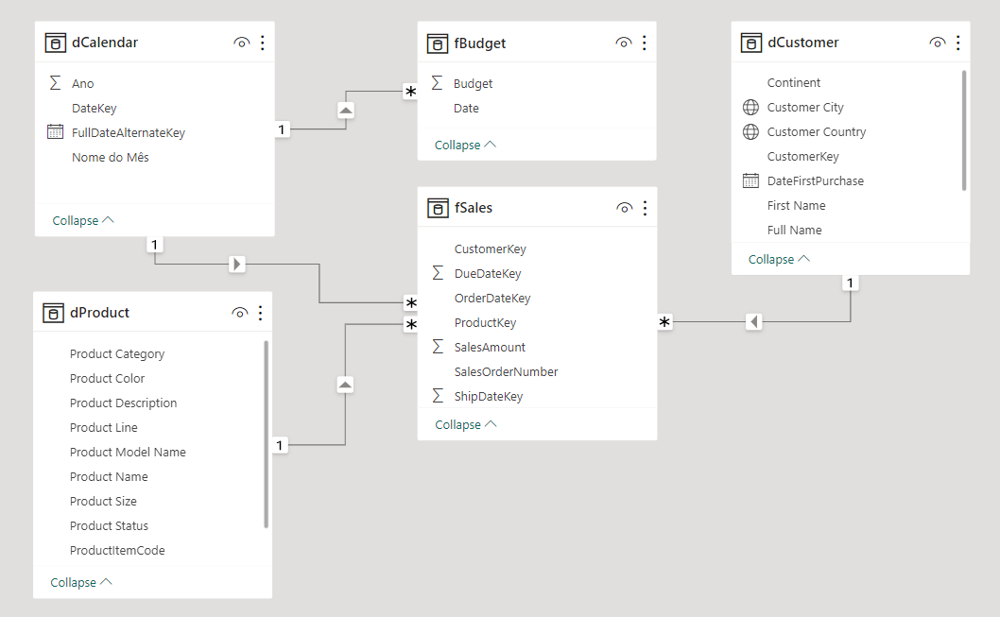

# AdventureWorks PowerBI Dashboard


# 1. Overview

The primary goal of this project is to create and publish an interactive Power BI dashboard using the Adventure Works dataset. This dataset, provided by Microsoft, serves as a perfect playground to practice and showcase proficiency in SQL, Microsoft SQL Server, and Power BI.

The data can be found in the link: [AdventureWorks sample databases - SQL Server | Microsoft Learn](https://learn.microsoft.com/en-us/sql/samples/adventureworks-install-configure?view=sql-server-ver15&tabs=ssms)

## 1.1 **Objectives**

1. **Skill Demonstration:** Throughout this project, we aim to exhibit our expertise in SQL, Microsoft SQL Server, and Power BI by transforming raw data into actionable visualizations.
2. **Interactive Dashboard:** Our focus lies in building an interactive and user-friendly dashboard that enables effortless exploration of the Adventure Works dataset.
3. **Data Visualization:** By leveraging Power BI's capabilities, we will create compelling visualizations to reveal patterns, trends, and crucial business insights.

## 1.2 **Project Structure**

The project is organized into distinct stages:

1. **Data Extraction and Cleaning:**
We'll start by getting the Adventure Works dataset and cleaning it using SQL in Microsoft SQL Server Management Studio (SSMS).
2. **Import Data into Power BI:**
Next, we'll import the cleaned dataset into Power BI for analysis.
3. **Enriching Data with Web Scraping:**
We'll enhance the dataset by adding continent information using web scraping and merge queries.
4. **Modeling Data:**
In this step, we'll organize and structure the data model within Power BI for better insights.
5. **Creating Visualizations:**
The final stage involves designing interactive charts and graphs to showcase key findings.

# 2. Data Extraction and Cleaning in SSMS with SQL

First thing to do is download and update it by using the provided SQL code from Microsoft in this [Github Repository](https://github.com/techtalkcorner/SampleDemoFiles/blob/master/Database/AdventureWorks/Update_AdventureWorksDW_Data.sql).

After Download the backup file (.bak), restore the Database in *Microsoft* *SQL Server Management Studio* (SSMS) and updating it. We can see all the tables available for our analisys:


We should also check if the update worked by quering the years in one of the tables like I noticed that the 'Sales' appears to be update,althoug the 'Dimension Date' years wasn’t. 
So I created another Date table with the SQL code, witch creates the columns DateKey (to link the table with the others tables) and FullDate. The rest of the columns like Day, Month, Year and etc can be easily extracted from these in Power BI.

```sql
CREATE TABLE DimDateNew (
    DateKey INT PRIMARY KEY,
    FullDateAlternateKey DATE
);

DECLARE @StartDate DATE = '2019-01-01';
DECLARE @EndDate DATE = '2023-12-31';
DECLARE @CurrentDate DATE = @StartDate;
DECLARE @DateKey INT = YEAR(@StartDate) * 10000 + MONTH(@StartDate) * 100 + DAY(@StartDate);

WHILE @CurrentDate <= @EndDate
BEGIN
    INSERT INTO DimDateNew (DateKey, FullDateAlternateKey)
    VALUES (@DateKey, @CurrentDate);

    SET @CurrentDate = DATEADD(DAY, 1, @CurrentDate);
    SET @DateKey = YEAR(@CurrentDate) * 10000 + MONTH(@CurrentDate) * 100 + DAY(@CurrentDate);
END;
```

Now we organize the *dimensions* and *fact* tables that we need, and create the views for it. It is also possible to download the CSV file and upload them in power BI. But I rather create the view since PBI can algo connect to the database and upload just the views, and in case we need another column in any table, we just alter the SQL code and after running, power bi will update the data, so we don’t have to save and load another CSV file.

```sql
--------------------------------
----Criating Fact Sales View----
--------------------------------
CREATE VIEW fSales AS
SELECT 
  fis.[ProductKey], 
  fis.[OrderDateKey], 
  fis.[DueDateKey], 
  fis.[ShipDateKey], 
  fis.[CustomerKey], 
  dg.[EnglishCountryRegionName] AS StoreCountry, -- Country of the store where the product was bought
  fis.[SalesOrderNumber], 
  fis.[SalesAmount] 
FROM
  FactInternetSales fis
JOIN DimCustomer dc ON fis.CustomerKey = dc.CustomerKey
JOIN DimGeography dg ON fis.[SalesTerritoryKey] = dg.[SalesTerritoryKey]
WHERE 
  fis.OrderDateKey BETWEEN '20200101' AND '20221212';

---------------------------------------
----Criating dimension Product View----
---------------------------------------

CREATE VIEW dProduct as
SELECT 
  p.[ProductKey], 
  p.[ProductAlternateKey] AS ProductItemCode, 
  p.[EnglishProductName] AS [Product Name], 
  ps.EnglishProductSubcategoryName AS [Sub Category], -- Joined in from Sub Category Table
  pc.EnglishProductCategoryName AS [Product Category], -- Joined in from Category Table
  p.[Color] AS [Product Color], 
  p.[Size] AS [Product Size], 
  p.[ProductLine] AS [Product Line], 
  p.[ModelName] AS [Product Model Name], 
  p.[EnglishDescription] AS [Product Description], 
  ISNULL (p.Status, 'Outdated') AS [Product Status] --Changed Status from Null to 'OutDated' 
FROM 
  DimProduct as p
  LEFT JOIN dbo.DimProductSubcategory AS ps ON ps.ProductSubcategoryKey = p.ProductSubcategoryKey 
  LEFT JOIN dbo.DimProductCategory AS pc ON ps.ProductCategoryKey = pc.ProductCategoryKey 

----------------------------------------
----Criating dimension Customer View----
----------------------------------------

CREATE VIEW dCustomer as 
SELECT 
  c.customerkey AS CustomerKey, 
  c.firstname AS [First Name], 
  c.lastname AS [Last Name], 
  c.firstname + ' ' + lastname AS [Full Name], 
  CASE c.gender WHEN 'M' THEN 'Male' WHEN 'F' THEN 'Female' END AS Gender, 
  c.datefirstpurchase AS DateFirstPurchase, 
  g.city AS [City], -- Joined in Customer City from Geography Table
  g.EnglishCountryRegionName as [Country], -- Joined in Country from Geography Table
  g.StateProvinceCode as [State] -- Joined in State from Geography Table
FROM 
  DimCustomer as c 
  LEFT JOIN dbo.dimgeography AS g ON g.geographykey = c.geographykey

----------------------------------------
----Criating dimension Calendar View----
----------------------------------------

CREATE VIEW dCalendar AS 
SELECT *
FROM DimDateNew
WHERE
  DateKey BETWEEN '20200101' AND '20221212'
```


After this we can see our views are created in View Tab:


# 4. Import Data in Power BI

Now that we have our data, we can connect the SQL server in power Bi: 


And then select the views we created:


## 4.1 Adding Continent column

Considering Adventure Works' global business, we have decided to include a Sales by Continent chart in the dashboard. However, the Geography dimension table initially lacked a continent column. To acomplish this, we can simply look for a list of countries and their continents from the web.

Instead of download and creating any new table,in the Power Query Editor, we click in New Source > Web, and paste the link of the [site with the countries and continents](https://statisticstimes.com/geography/countries-by-continents.phphttps://statisticstimes.com/geography/countries-by-continents.php)


Power BI will find some tables in the site and we select the one we’re looking for:


After loading the table to the Power Query Editor, we can make a *Merge Queries* with the dcustomer table by the country and add the Continent column to it 


# 5. Model View

Now we can link all the tables and implement a Star Schema model, this design allows dimensions to act as filters for analysis.

You can see that all the dimensions are linked to the facts table in a 1 to many relationship



# 6. DataViz

In this section I’ll dissect the layout of the Dashboard that is hosted in microsft server, and can be acessed by this link: [Sales Overview](https://app.powerbi.com/view?r=eyJrIjoiMzUyMjdjMTUtNzg1Yy00NTdkLWJhOTYtYmY0ZGY0NjFiMDFjIiwidCI6ImUyZjc3ZDAwLTAxNjMtNGNmNi05MmIwLTQ4NGJhZmY5ZGY3ZCJ9)


## 6.1 KPI Tooltip:

 On the Budget x Sales over time Line Chart we have a KPI Tooltip, when we pass the mouse over it, we can see dynamic details of the Budget and Sales in that specif month. 


To this it is needed to download **Dynamic KPI Card by Sereviso** in the ‘get more views’ options


